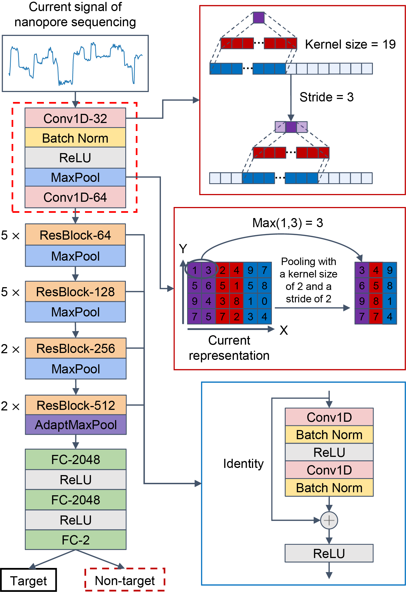
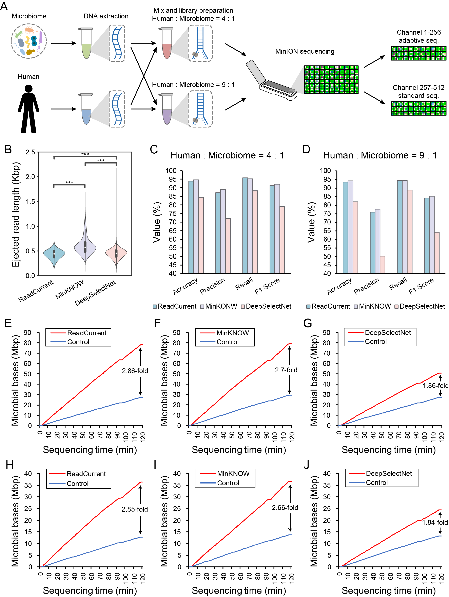

# ReadCurrent: A VDCNN-based tool for fast and accurate nanopore selective sequencing

Nanopore selective sequencing allows the targeted sequencing of DNA of interest using computational approaches rather than experimental methods such as targeted multiplex polymerase chain reaction or hybridization capture. Compared to sequence-alignment strategies, deep learning (DL) models for classifying target and non-target DNA provide large speed advantages. However, the relatively low accuracy of these DL-based tools hinders their application in nanopore selective sequencing [[1-4](#reference)]. Here, we present a DL-based tool named ReadCurrent for nanopore selective sequencing, which takes electric currents as inputs. ReadCurrent employs a modified very deep convolutional neural network (VDCNN) architecture, enabling significantly lower computational costs for training and quicker inference compared to conventional VDCNN. 



We evaluated the performance of ReadCurrent across ten nanopore sequencing datasets spanning human, yeasts, bacteria, and viruses. We observed that ReadCurrent achieved a mean accuracy of 98.57% for classification, outperforming four other DL-based selective sequencing methods. In experimental validation that selectively sequenced microbial DNA from human DNA, ReadCurrent achieved an enrichment ratio of 2.85, which was higher than the 2.7 ratio achieved by MinKNOW using the sequence-alignment strategy. In summary, ReadCurrent can rapidly classify target and non-target DNA with high accuracy, providing an alternative in the toolbox for nanopore selective sequencing.



## Install

### Dependencies

```shell
python=3.9
pytorch=1.12.1
scikit-learn=1.2.2
matplotlib=3.7.1
tqdm=4.65.0
snakemake=7.32.4
ont-fast5-api=4.1.1
minimap2=2.17
samtools=1.16.1
read_until_api=3.4.1
```

### Install ReadCurrent by Conda

#### 1. [Install Conda](https://docs.conda.io/projects/conda/en/latest/user-guide/install/index.html)

#### 2. Download ReadCurrent source code

#### 3. Create Conda virtual environment for ReadCurrent

```shell
conda env create -f environment.yaml
```

#### 4. [Install read_until_api](https://github.com/nanoporetech/read_until_api) (optional, only required for nanopore selective sequencing experiments)

```shell
# Install from github:
pip install git+https://github.com/nanoporetech/read_until_api@master
# Or from a local clone
python setup.py install
```

## Quickly start

### train

```shell
python trainer.py -p example/zymo/ -n example/human/ -o example/result/zymo_human -g 0 -preprocess
```

or

```shell
python preprocessor.py -d example/zymo/
python preprocessor.py -d example/human/
python trainer.py -p example/zymo/ -n example/human/ -o example/result/zymo_human -g 0
```

### test

```shell
python tester.py -p example/zymo/ -n example/human/ -ms example/result/zymo_human/model.pth -o example/result/zymo_human/ -g 0
```

## Scripts

### get_ids.smk

Get the ids of reads that were successfully aligned (mapping quality >= 1) to the reference genome

```shell
config arguments:
  fastq_path            The directory where the fastq files is located, all fastq/fastq.gz files should be in the same folder
  ref_path              The path of the reference file
  align_threads         Number of threads using minimap2 for sequence alignment
  output                Output path for alignment results and read ids
```

Example:

```shell
snakemake -s tools/get_ids.smk --config fastq_path={fastq_path} ref_path={ref_path} align_threads=16 output={output_path} --cores 1
```

### read_fast5.py

Constructing training, validation, and testing sets from the fast5 files of nanopore sequencing data

```shell
usage: read_fast5.py [-h] --file_dir FILE_DIR --output OUTPUT [--read_ids READ_IDS] [--min_length MIN_LENGTH] [--train_size TRAIN_SIZE] [--valid_size VALID_SIZE] [--test_size TEST_SIZE]

Read fast5

optional arguments:
  -h, --help            show this help message and exit
  --file_dir FILE_DIR, -dir FILE_DIR
                        The directory where the fast5 files is located
  --output OUTPUT, -o OUTPUT
                        Storage path for output files
  --read_ids READ_IDS, -ids READ_IDS
                        The path for read ids file
  --min_length MIN_LENGTH, -len MIN_LENGTH
                        Minimum length of each electrical signal, default 4500
  --train_size TRAIN_SIZE, -train TRAIN_SIZE
                        Number of electrical signals to be read for training, default 20000
  --valid_size VALID_SIZE, -valid VALID_SIZE
                        Number of electrical signals to be read for validation, default 10000
  --test_size TEST_SIZE, -test TEST_SIZE
                        Number of electrical signals to be read for testing, default 10000
```

Example:

```shell
python tools/read_fast5.py -dir {fast5_dir} -o {output_path} -ids {read_ids_path}
```

### preprocessor.py (optional)

Perform data preprocessing on training and validation sets from the dataset folder (can also be done in train.py)

```shell
usage: preprocessor.py [-h] --data_folder DATA_FOLDER [--cut CUT] [--tiling_fold TILING_FOLD] [--length LENGTH] [--patches] [--seq_length SEQ_LENGTH] [--stride STRIDE] [--patch_size PATCH_SIZE]

Data preprocessing

optional arguments:
  -h, --help            show this help message and exit
  --data_folder DATA_FOLDER, -d DATA_FOLDER
                        Path to the dataset folder that contains train, valid, test files (.npy)
  --cut CUT, -c CUT     Electrical signal length to be cut, default 1500
  --tiling_fold TILING_FOLD, -tf TILING_FOLD
                        Number of tiles, default 3
  --length LENGTH, -l LENGTH
                        The length of the sliding window, default 3000
  --patches, -patches   Convert electrical signals into patches, default False
  --seq_length SEQ_LENGTH, -sl SEQ_LENGTH
                        Sequence length after patch, default 299
  --stride STRIDE, -s STRIDE
                        Patch step size, default 10
  --patch_size PATCH_SIZE, -ps PATCH_SIZE
                        The size of patch, default 16
```

Example:

```shell
python preprocessor.py -d {dataset_folder}
```

### trainer.py

Train the model on the specified dataset

```shell
usage: trainer.py [-h] --pos_data_folder POS_DATA_FOLDER --neg_data_folder NEG_DATA_FOLDER --output OUTPUT [--preprocess] [--cut CUT] [--tiling_fold TILING_FOLD] [--length LENGTH] [--patches]
                  [--seq_length SEQ_LENGTH] [--stride STRIDE] [--patch_size PATCH_SIZE] [--batch_size BATCH_SIZE] [--epochs EPOCHS] [--learning_rate LEARNING_RATE] [--tolerance TOLERANCE] [--interm INTERM]
                  [--num_workers NUM_WORKERS] [--gpu_ids GPU_IDS]

Training model

optional arguments:
  -h, --help            show this help message and exit
  --pos_data_folder POS_DATA_FOLDER, -p POS_DATA_FOLDER
                        Path to the positive dataset folder that contains train, valid, test files (.npy)
  --neg_data_folder NEG_DATA_FOLDER, -n NEG_DATA_FOLDER
                        Path to the negative dataset folder that contains train, valid, test files (.npy)
  --output OUTPUT, -o OUTPUT
                        The output path
  --preprocess, -preprocess
                        Whether to preprocess the training and validation dataset, default False
  --cut CUT, -c CUT     Electrical signal length to be cut, default 1500
  --tiling_fold TILING_FOLD, -tf TILING_FOLD
                        Number of tiles, default 3
  --length LENGTH, -l LENGTH
                        The length of the sliding window, default 3000
  --patches, -patches   Convert electrical signals into patches, default False
  --seq_length SEQ_LENGTH, -sl SEQ_LENGTH
                        Sequence length after patch, default 299
  --stride STRIDE, -s STRIDE
                        Patch step size, default 10
  --patch_size PATCH_SIZE, -ps PATCH_SIZE
                        The size of patch, default 16
  --batch_size BATCH_SIZE, -b BATCH_SIZE
                        Batch size, default 1024
  --epochs EPOCHS, -e EPOCHS
                        Number of epoches, default 300
  --learning_rate LEARNING_RATE, -lr LEARNING_RATE
                        Learning rate, default 1e-3
  --tolerance TOLERANCE, -t TOLERANCE
                        Tolerance for non increase in accuracy during training, default 10
  --interm INTERM, -i INTERM
                        The path for model checkpoint, default None
  --num_workers NUM_WORKERS, -nw NUM_WORKERS
                        The size of num_workers in Dataloader, default 0
  --gpu_ids GPU_IDS, -g GPU_IDS
                        Specify the GPU to use, if not specified, use all GPUs or CPU, default None
```

Example:

```shell
python trainer.py -p {pos_data_folder} -n {neg_data_folder} -o {output_path} -g 0
```

### tester.py

Test the model on the specified dataset

```shell
usage: tester.py [-h] --pos_data_folder POS_DATA_FOLDER --neg_data_folder NEG_DATA_FOLDER --model_state MODEL_STATE --output OUTPUT [--batch_size BATCH_SIZE] [--cut CUT] [--length LENGTH] [--patches]
                 [--seq_length SEQ_LENGTH] [--stride STRIDE] [--patch_size PATCH_SIZE] [--gpu_ids GPU_IDS]

Test model

optional arguments:
  -h, --help            show this help message and exit
  --pos_data_folder POS_DATA_FOLDER, -p POS_DATA_FOLDER
                        Path to the positive dataset folder that contains train, valid, test files (.npy)
  --neg_data_folder NEG_DATA_FOLDER, -n NEG_DATA_FOLDER
                        Path to the negative dataset folder that contains train, valid, test files (.npy)
  --model_state MODEL_STATE, -ms MODEL_STATE
                        Path of the model (a pth file)
  --output OUTPUT, -o OUTPUT
                        The output path
  --batch_size BATCH_SIZE, -b BATCH_SIZE
                        Batch size, default 512
  --cut CUT, -c CUT     Electrical signal length to be cut, default 1500
  --length LENGTH, -len LENGTH
                        The length of each signal segment, default 3000
  --patches, -patches   Convert electrical signals into patches, default False
  --seq_length SEQ_LENGTH, -sl SEQ_LENGTH
                        Sequence length after patch, default 299
  --stride STRIDE, -s STRIDE
                        Patch step size, default 10
  --patch_size PATCH_SIZE, -ps PATCH_SIZE
                        The size of patch, default 16
  --gpu_ids GPU_IDS, -g GPU_IDS
                        Specify the GPU to use, if not specified, use all GPUs or CPU, default None
```

Example:

```shell
python tester.py -p {pos_data_folder} -n {neg_data_folder} -ms {model_state_path} -o {output_path} -g 0
```

### ReadCurrent_adaptive.py

Nanopore selective sequencing using ReadCurrent

```shell
usage: Read until API demonstration.. [-h] [--host HOST] [--port PORT] [--ca-cert CA_CERT] [--workers WORKERS] [--analysis_delay ANALYSIS_DELAY] [--run_time RUN_TIME]
                                      [--unblock_duration UNBLOCK_DURATION] [--one_chunk] [--min_chunk_size MIN_CHUNK_SIZE] [--debug] [--verbose] --model_state MODEL_STATE
                                      --output OUTPUT [--gpu_ids GPU_IDS]

optional arguments:
  -h, --help            show this help message and exit
  --host HOST           MinKNOW server host.
  --port PORT           MinKNOW gRPC server port.
  --ca-cert CA_CERT     Path to alternate CA certificate for connecting to MinKNOW.
  --workers WORKERS     worker threads.
  --analysis_delay ANALYSIS_DELAY
                        Period to wait before starting analysis.
  --run_time RUN_TIME   Period to run the analysis.
  --unblock_duration UNBLOCK_DURATION
                        Time (in seconds) to apply unblock voltage.
  --one_chunk           Minimum read chunk size to receive.
  --min_chunk_size MIN_CHUNK_SIZE
                        Minimum read chunk size to receive. NOTE: this functionality is currently disabled; read chunks received will be unfiltered.
  --debug               Print all debugging information
  --verbose             Print verbose messaging.
  --model_state MODEL_STATE
                        Path of the model (a pth file)
  --output OUTPUT       The output path
  --gpu_ids GPU_IDS     Specify the GPU to use, if not specified, use all GPUs or CPU, default None
```

Example:

```shell
python read_until_api-3.4.1/read_until/ReadCurrent_adaptive.py --run_time 7200 --model_state {model_state_path} --output {output_path} --gpu_ids 0
```

## Reference

1. Bao Y, Wadden J, Erb-Downward JR. et al.  SquiggleNet: real-time, direct classification of nanopore signals. Genome Biol 2021;22:298. https://doi.org/10.1186/s13059-021-02511-y.
2. Danilevsky A, Polsky AL, Shomron N. Adaptive sequencing using nanopores and deep learning of mitochondrial DNA. Brief Bioinform 2022;23:bbac251. https://doi.org/10.1093/bib/bbac251.
3. Senanayake A, Gamaarachchi H, Herath D. et al.  DeepSelectNet: deep neural network based selective sequencing for oxford nanopore sequencing. BMC Bioinformatics 2023;24:31. https://doi.org/10.1186/s12859-023-05151-0.
4. Lin Y, Zhang Y, Sun H. et al.  NanoDeep: a deep learning framework for nanopore adaptive sampling on microbial sequencing. Brief Bioinform 2023;25:bbad499. https://doi.org/10.1093/bib/bbad499.

## License

[MIT](LICENSE)